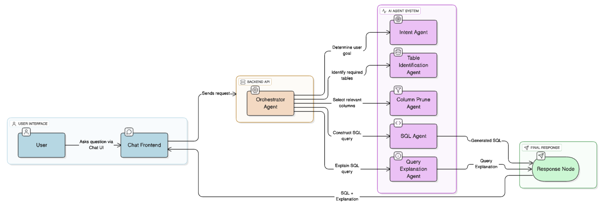
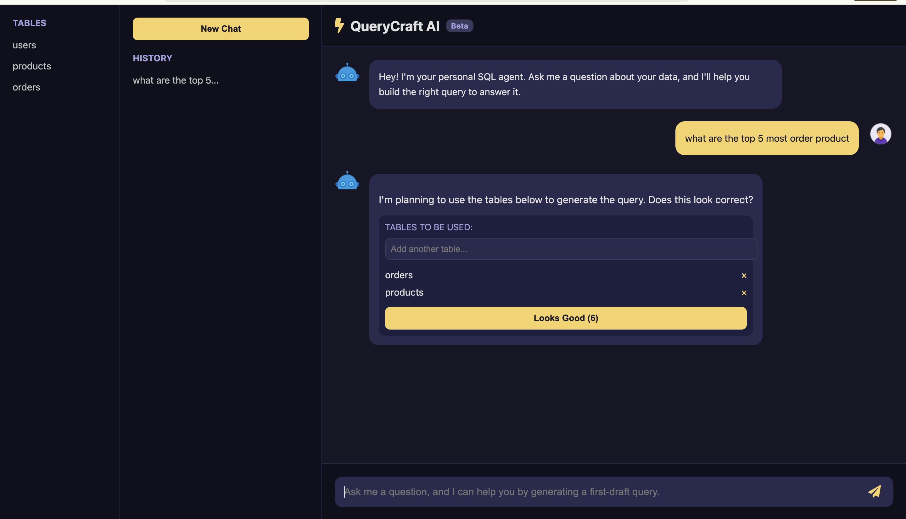
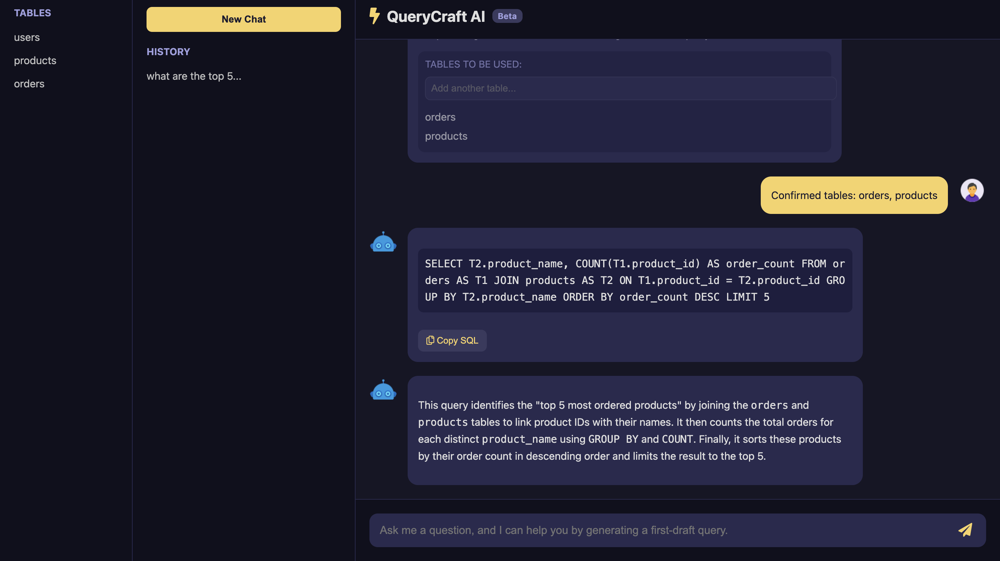
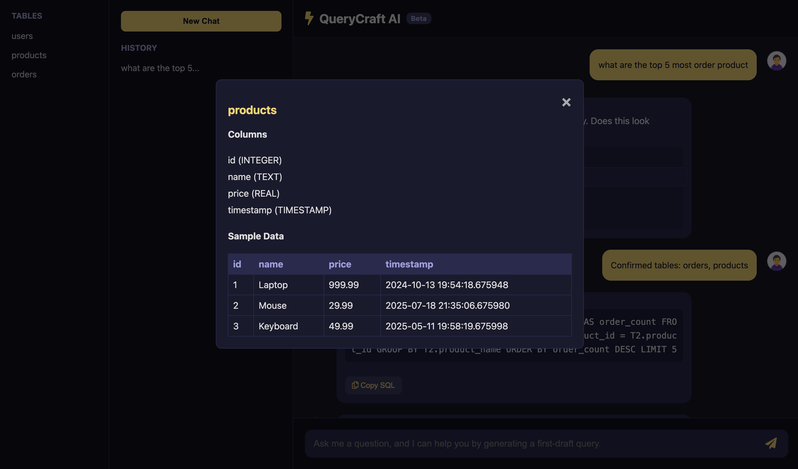

# 🧠 Product Document: QueryCraftAI

## 🚀 QueryCraftAI — Conversational Intelligence for Databases

QueryCraftAI is an open-source, multi-agent AI system that turns plain English questions into optimized SQL queries — and explains the logic behind them.

It bridges the gap between complex relational schemas and human-friendly natural language, enabling developers, analysts, and business users to explore data conversationally without writing a single line of SQL.

> Vision: Democratize data access — make querying as simple as having a conversation.

## 🔗 Live Demo: https://codewithabhi.pythonanywhere.com/

## 🧩 Key Highlights
- Multi-Agent Orchestration: Modular agentic pipeline — intent detection, table identification, column pruning, SQL generation, and explanation — each powered by structured LLM calls.
- Context-Aware Querying: Maintains chat history and dynamically enhances prompts to handle follow-ups and modifications intelligently.
- Schema-Constrained Generation: Every SQL is schema-validated — no hallucinated tables or columns.
- Explainable AI Queries: Each generated SQL comes with a concise, human-readable explanation.
- Open Source & Extensible: Easily integrate with any SQL database, enhance with RAG, or plug in your own agents.


## 🧱 System Architecture

The application uses a multi-agent system where each agent has a specialized role. The process is orchestrated by a backend Flask API and presented to the user through a simple frontend.



### Dashboard / User Interface Screenshots

#### Main Chat Interface


#### SQL Query Result


#### Additional Features


## 💼 Use Cases

*   **Rapid Prototyping:** Developers can quickly generate complex queries needed for new application features.
*   **Data Exploration:** Analysts can perform ad-hoc analysis without writing boilerplate SQL.
*   **Business Intelligence:** Business users can get answers to questions like "How many new users signed up last week?" without waiting for an analyst.
*   **Learning SQL:** Junior developers or students can use the agent as a tool to learn SQL by seeing how their questions translate into code.

## ⚡ Getting Started

To get a local instance of the agent running, follow these steps:

1.  **Install dependencies:**
    ```bash
    pip install -r requirements.txt
    ```
2.  **Run the development server:**
    ```bash
    ./devserver.sh
    ```
3.  **Open your browser** and navigate to the local URL provided.

## 🛣️ Roadmap: The Future of Conversational Data

This project is just the beginning. Our future plans include:

*   [ ] **Support for More SQL Dialects:** Adding support for PostgreSQL, MySQL, and others.
*   [ ] **Data Visualization:** Automatically generating charts and graphs to visualize the query results.
*   [ ] **Query History & Saving:** Allowing users to save and reuse frequently asked questions.
*   [ ] **Advanced Data Context:** Enabling the agent to understand more complex relationships and business-specific logic.
*   [ ] **Integration with BI Tools:** Connecting the agent to popular BI platforms.

## 🤝 Contributing

This is an open-source project, and we welcome contributions from the community! Whether it\'s a bug fix, a new feature, or improved documentation, your help is valued.
